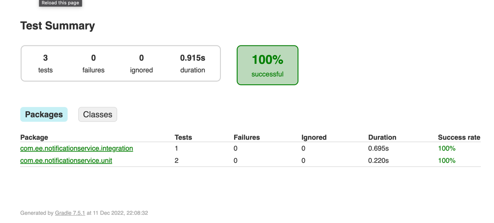
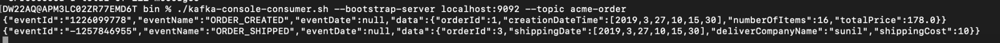
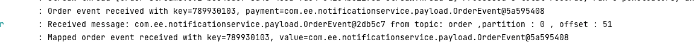

Component Name - Notification Service

It does the following:
- subscribe to the **order** topic in an internal Kafka
- process all the incoming messages that relates to the creation of a new order or the shipping of an order
- publish an event on a specific different Kafka topic **acme-order**

#### EE order created event

When one of the ACME users create a new order, the Amasson system generate an event OrderCreated on the order Kafka topic. The message contains
the following information:

    CustomerId (integer)
    CustomerName (string)
    CreationDateTime (DateTime)
    OrderId (integer)
    OrderRows (array of OrderRow objects)

The OrderRow objects has the following properties:

    OrderRowId (integer)
    ItemId (integer)
    Quantity (integer)
    UnitaryPrice (money)
    EE order shipped event

When an order is shipped, then the EE system generate an OrderShipped event with the following data structure:

    OrderId (integer)
    ShippingDate (DateTime)
    DeliveryCompanyId (integer)
    DeliveryCompanyName (string)
    ShippingCost (money)
    WarehousePosition (integer)

#### ACME order created message 

When an order is created, the ACME should receive a message with the following structure:

    OrderId
    CreationDateTime (DateTime)
    NumberOfItems (integer)
    TotalPrice (money)
    ACME order shipped message

When an order is shipped, the ACME should receive a message with the following structure:

    OrderId (integer)
    ShippingDate (DateTime)
    DeliveryCompanyName (string)
    ShippingCost (money)

The component is built using Java Spring Boot and Kafka streams.

## Integration Tests

Run integration tests with ./gradlew build

The tests demonstrate streaming order events that are  transformed, and results emitted to outbound topics.

Test Result

## Improvements

1. Dockerize the component and also kafka 
2. Add SSL to kafka
3. More Exception handling and retry scenarios
4. More automated tests.
5. Add more event data like correlation id or trace id

## Running the project locally

1. Download Kafka _https://kafka.apache.org/downloads_
2. Navigate to bin directory
3. Add the below properties in the server.properties

        listeners=PLAINTEXT://localhost:9092

Start Zookeeper

    ./zookeeper-server-start.sh ../config/zookeeper.properties

Start up the Kafka Broker

    ./kafka-server-start.sh ../config/server.properties

Send a Kafka message to topic order with below payload

    {
    "orderId": 3,
    "shippingDate": "2019-03-27T10:15:30",
    "deliveryCompanyId": 345,
    "deliveryCompanyName": "sunil",
    "shippingCost": 10,
    "wareHousePosition": 54
    }

OR

    {
        "customerId": 5,
        "customerName": "sunil",
        "creationDateTime": "2019-03-27T10:15:30",
        "orderId": 1,
        "orderRows": [
            {
            "orderRowId": 1,
            "itemId": 1,
            "quantity": 1,
            "unitaryPrice": 20.50
            },
            {
            "orderRowId": 2,
            "itemId": 2,
            "quantity": 5,
            "unitaryPrice": 10.50
            },
            {
            "orderRowId": 3,
            "itemId": 3,
            "quantity": 10,
            "unitaryPrice": 10.50
            }
        ]
    }

View result in acme-order topic
    
    ./kafka-console-consumer.sh --bootstrap-server localhost:9092 --topic acme-order

Result : 